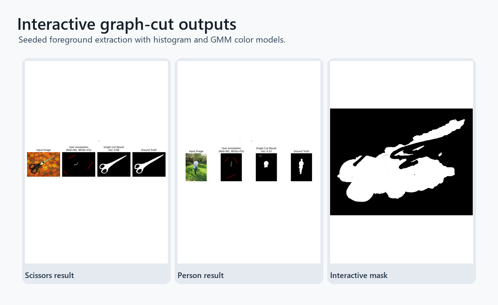

# Interactive Graph Cut Segmentation

Interactive foreground/background segmentation with scribbles, histogram and Gaussian-mixture color models, graph cuts, and dataset-level evaluation.

## Highlights

- Uses user scribbles to build foreground and background color models.
- Supports histogram and GMM unary terms.
- Optimizes binary labels with graph cuts and pairwise smoothness.
- Includes an OpenCV interaction loop with undo, save, and optional IoU scoring.
- Ships sample inputs, scribbles, ground truth masks, and result figures.

## Repository Layout

- `graphcut_core.py` - color models, graph construction, segmentation, and evaluation.
- `interactive_tool.py` - interactive scribble UI.
- `dataset/` - images, scribbles, masks, and generated segmentation outputs.
- `examples/` - selected visual outputs.

## Setup

```bash
pip install -r requirements.txt
```

## Run

```bash
python graphcut_core.py
python interactive_tool.py dataset/images/scissors.jpg
```

## Segmentation output



Foreground extraction examples from scribble-based graph-cut segmentation.


## Graph-cut workflow

- Interactive segmentation with graph construction, seed labels, and min-cut optimization.
- Comparison between histogram and GMM color models.
- Reusable core logic plus a lightweight interactive tool entry point.


## Annotation-tool boundaries

- Segmentation quality depends heavily on scribble quality and color separability.
- The GUI path is intentionally lightweight rather than a polished annotation product.
- Next steps: add quantitative IoU summaries and a batch evaluation script.

